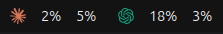
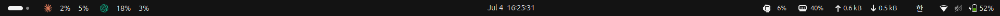
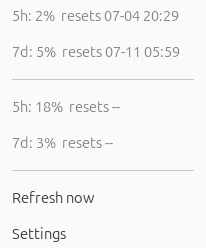
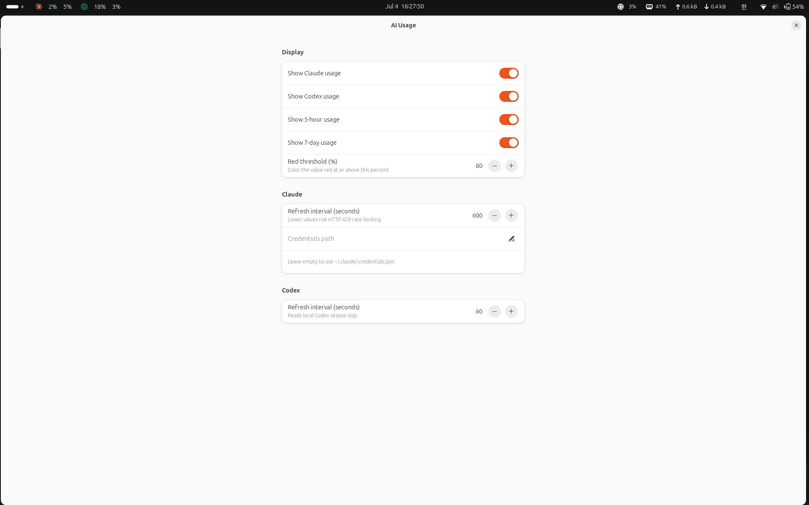

# AI Usage

A GNOME Shell extension that shows your **Claude.ai** and **Codex** usage in
the top bar.

It displays the current utilization for the rolling **5-hour** and **7-day**
windows for each provider, turns red past a configurable threshold, and shows
the exact percentages and reset times in its dropdown menu.

<p align="center">
  
</p>

…sitting at the left of the GNOME top bar, clear of your other system
indicators:

<p align="center">
  
</p>

## Features

- Claude and Codex usage side by side in the panel, each independently
  toggleable
- 5-hour and 7-day utilization per provider, each independently toggleable
- Configurable "red" alert threshold (default 80%)
- Independent refresh intervals per provider (Claude defaults to 600 s since
  it polls a remote API; Codex defaults to 60 s since it reads local files)
- Dropdown menu with exact utilization + reset time per provider/window, and
  a "Refresh now" action
- On a failed refresh (e.g. HTTP 429), keeps showing the last good value
  marked stale with a `+` (e.g. `31+%`) instead of `--%`
- Adwaita preferences UI

Click the panel button for exact percentages, reset times, and a manual
**Refresh now** action:

<p align="center">
  
</p>

## Requirements

- GNOME Shell 45–48 (developed and tested on 46)
- [Claude Code](https://github.com/anthropics/claude-code) signed in, so that
  an OAuth token exists at `~/.claude/.credentials.json` (for Claude usage)
- [Codex CLI](https://github.com/openai/codex) session logs under
  `~/.codex/sessions` (or `$CODEX_HOME/sessions`) (for Codex usage)

Both are optional — each provider can be toggled off in the preferences if
you don't use it.

## Install

```sh
git clone https://github.com/6K5EUQ/ai-usage-gnome.git
cd ai-usage-gnome
make install        # builds the zip and installs it for the current user
```

Then restart GNOME Shell so it picks up the new extension:

- **X11:** press `Alt`+`F2`, type `r`, press `Enter`
- **Wayland:** log out and back in

Finally enable it:

```sh
make enable
# or: gnome-extensions enable ai-usage@6k5euq
```

Open the settings any time with:

```sh
gnome-extensions prefs ai-usage@6k5euq
```

## Configuration

| Setting                      | Default | Description                                        |
|-------------------------------|---------|----------------------------------------------------|
| Show Claude usage             | on      | Show the Claude provider in the panel               |
| Show Codex usage              | on      | Show the Codex provider in the panel                |
| Show 5-hour usage             | on      | Show the 5-hour window for each shown provider      |
| Show 7-day usage              | on      | Show the 7-day window for each shown provider       |
| Red threshold (%)             | 80      | Color the value red at or above this percentage     |
| Claude refresh interval (s)   | 600     | Poll frequency; low values risk HTTP 429            |
| Codex refresh interval (s)    | 60      | How often to re-read local Codex session logs       |
| Credentials path              | (empty) | Override; empty uses `~/.claude/.credentials.json`  |

All settings live in the Adwaita preferences window:

<p align="center">
  
</p>

## How it works

**Claude:** the extension polls `GET https://api.anthropic.com/api/oauth/usage`
— the same endpoint the Claude Code `/usage` command uses — authenticated
with the OAuth access token read from `~/.claude/.credentials.json`.

> **Note:** this is an *undocumented* internal endpoint. It may change or stop
> working on any Claude Code / API update.

**Codex:** the extension reads the most recently modified `.jsonl` session
log under `~/.codex/sessions` (or `$CODEX_HOME/sessions`) and extracts the
latest `rate_limits` entry written by the Codex CLI. No network request or
token is used.

## Privacy & security

- The extension reads your Claude token only from your local credentials
  file and sends it **only** to Anthropic's own API, over HTTPS, to fetch
  your usage.
- Codex usage is read entirely from local session logs; no network request
  is made for it.
- No token, account data, or telemetry is sent anywhere else, stored by the
  extension, or written into this repository.
- Your credentials file is never part of the repo (and is `.gitignore`d).

## Development

```
extension.js   panel indicator + polling (runs inside GNOME Shell)
prefs.js       Adwaita settings UI (runs in a separate prefs process)
schemas/       GSettings schema
icons/         panel logo marks
Makefile       pack / install / enable / disable / clean
```

```sh
make pack       # build ai-usage@6k5euq.shell-extension.zip
make clean      # remove build artifacts
```

## License

[GPL-2.0-or-later](LICENSE).

The Claude and ChatGPT/Codex logo marks in `icons/` are trademarks of
Anthropic and OpenAI respectively, used here only to indicate which usage
figures each panel section shows. This project is not affiliated with or
endorsed by Anthropic or OpenAI.
