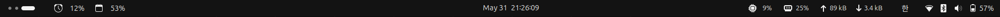

# Claude Usage Bar

A GNOME Shell extension that shows your **Claude.ai usage** in the top bar.

It displays the current utilization for the rolling **5-hour** and **7-day**
windows, turns red past a configurable threshold, and shows the exact
percentages and reset times in its dropdown menu.

<p align="center">
  
</p>

A compact ⏰ (5-hour) / 📅 (7-day) readout that sits at the left of the
GNOME top bar, clear of your other system indicators:

<p align="center">
  
</p>

…and in context on the desktop:

<p align="center">
  
</p>

## Features

- 5-hour and 7-day utilization in the panel, each independently toggleable
- Configurable "red" alert threshold (default 80%)
- Configurable refresh interval (default 600 s)
- Dropdown menu with exact utilization + reset time per window, and a
  "Refresh now" action
- On a failed refresh (e.g. HTTP 429), keeps showing the last good value
  marked stale with a `+` (e.g. `31+%`) instead of `--%`
- Adwaita preferences UI

Click the panel button for exact percentages, reset times, and a manual
**Refresh now** action:

<p align="center">
  
</p>

## Requirements

- GNOME Shell 45–48 (developed and tested on 46)
- [Claude Code](https://github.com/anthropics/claude-code) signed in, so that
  an OAuth token exists at `~/.claude/.credentials.json`

## Install

```sh
git clone https://github.com/6K5EUQ/claude-usage-gnome.git
cd claude-usage-gnome
make install        # builds the zip and installs it for the current user
```

Then restart GNOME Shell so it picks up the new extension:

- **X11:** press `Alt`+`F2`, type `r`, press `Enter`
- **Wayland:** log out and back in

Finally enable it:

```sh
make enable
# or: gnome-extensions enable claude-usage@6k5euq
```

Open the settings any time with:

```sh
gnome-extensions prefs claude-usage@6k5euq
```

## Configuration

| Setting              | Default | Description                                      |
|----------------------|---------|--------------------------------------------------|
| Show 5-hour usage    | on      | Show the 5-hour window in the panel              |
| Show 7-day usage     | on      | Show the 7-day window in the panel               |
| Red threshold (%)    | 80      | Color the value red at or above this percentage  |
| Refresh interval (s) | 600     | Poll frequency; low values risk HTTP 429         |
| Credentials path     | (empty) | Override; empty uses `~/.claude/.credentials.json` |

All settings live in the Adwaita preferences window:

<p align="center">
  
</p>

## How it works

The extension polls `GET https://api.anthropic.com/api/oauth/usage` — the same
endpoint the Claude Code `/usage` command uses — authenticated with the OAuth
access token read from `~/.claude/.credentials.json`.

> **Note:** this is an *undocumented* internal endpoint. It may change or stop
> working on any Claude Code / API update.

## Privacy & security

- The extension reads your token only from your local credentials file and
  sends it **only** to Anthropic's own API, over HTTPS, to fetch your usage.
- No token, account data, or telemetry is sent anywhere else, stored by the
  extension, or written into this repository.
- Your credentials file is never part of the repo (and is `.gitignore`d).

## Development

```
extension.js   panel indicator + polling (runs inside GNOME Shell)
prefs.js       Adwaita settings UI (runs in a separate prefs process)
schemas/       GSettings schema
Makefile       pack / install / enable / disable / clean
```

```sh
make pack       # build claude-usage@6k5euq.shell-extension.zip
make clean      # remove build artifacts
```

## License

[GPL-2.0-or-later](LICENSE).

This project is not affiliated with or endorsed by Anthropic.
